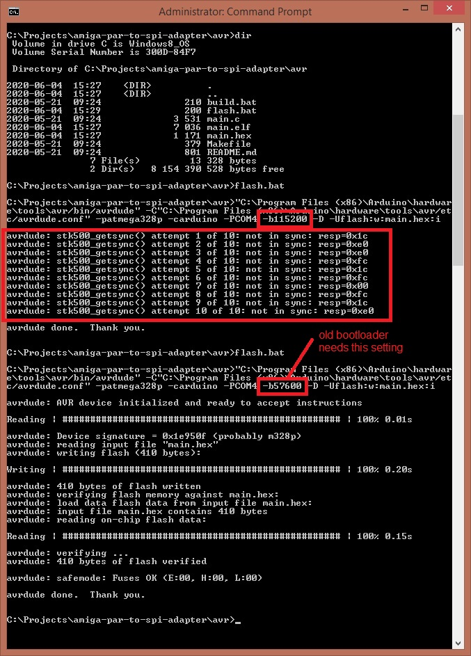

# AVR microcontroller code

The AVR code is carefully timed.
For each byte that is read or written, the AVR has 45 clock cycles (at 16 MHz) to:

- start an SPI tranfer
- wait until the SPI transfer is complete
- wait until the Amiga signals that it is ready to receive or send a byte
- read/write the byte to send/receive

## Building and flashing

On Linux: running `make` will build the hex file and flash it to the AVR using the Arduino boot loader method. You can use `make build` and `make flash` to perform the steps individually.

On Windows: `build.bat` builds the hex file, and `flash.bat` flashes it. These batch files assumes that you have installed the Arduino IDE in the usual location. Note that you have to update which COM port the Arduino is connected to in flash.bat.

## Flashing with old bootloader

If you get sync errors when flashing the Nano V3 you might have a Nano with the old bootloader. To flash use `-b57600` setting instead and it should work fine, like this:

