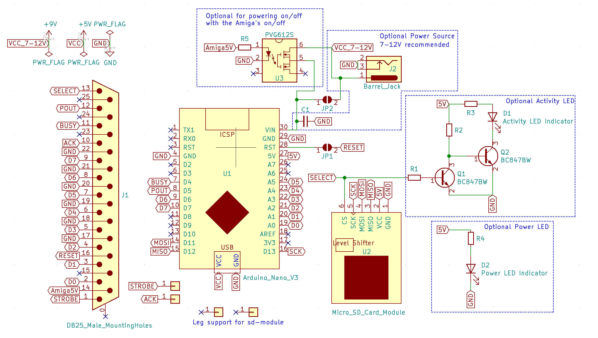

## sdbox for Amiga

This is a PCB made in KiCad (5.1.2-1) for hooking up an Arduino Nano V3 with a micro-sd-card module to the Amiga parallel-port.

***

For 3d-printing the sdbox case, check the README in the DSM folder.

***

BOM, NOT 100% verified  yet!!!, still need to verify the optional barrel jack power connector with or without U3 and the U3 circuit working or not.

***

PART  | Value | Description
----- | ----- | -------
U1    |       | Arduino Nano V3
U2    |       | Micro SD-Card Adapter (with onboard bidirectional level shifter)
U2    |Pin strip| 1 Pcs 2.54mm Single Row Male Pin Header Strip For mounting and connecting Micro SD-Card Adapter directly into base PCB. Cut out one with 6 pins and two with single pins. The current angled pins on module will be desoldered and removed.
U3    |PVG612S| Solid State Relay, 6-SMD (0,300", 7,62mm) Automatic power down with the Amiga (optional)
J1    |DB25   | DB25 Male MountingHoles 
J2    |5.5x2.1 mm | Barrel Jack Power Connector, center positive (optional)
C1    |100uF-220uF| 1210 ceramic decoupling capacitor for VIN, 16 VDC or at least above you voltage input 7-12V.
R1    |4.7k Ohm| 1206 smd resistor (should give around 0.9mA when CS/SEL is high)
R2    |4.7k Ohm| 1206 smd resistor
R3    |120 Ohm| 1206 smd resistor (should give around 2.14V, 24 mA over D1)
R4    |120 Ohm| 1206 smd resistor (should give around 2.17V, 24 mA over D2)
R5    |330 Ohm| 1206 smd resistor (should give around 1.2V and 10 mA control current with the Amiga 47 Ohm in series from pin 14)
D1    |LED 3mm| SD Activity LED, Diffused Orange / Amber, pitch 2.54 mm, 1.8V-2.3V, 20-30 mA, 605-610nm
D2    |LED 3mm| Power LED, Green Diffused T-1, pitch 2.54 mm, 25 mcd, 565 nm, 2.2 V, 25 mA
Q1    |BC847BW| Small Signal Transistor, NPN polarity, SOT-323
Q2    |BC847BW| Small Signal Transistor, NPN polarity, SOT-323
JP1   |Solder jumper| Enable this to reset Nano in conjunction with Ctrl-Amiga-Amiga
JP2   |Solder jumper| Enable this to use barrel jack connector without U3 chip

***

***
