# SD card module

An SD card module can be used with the SPI adapter in order to mount the SD card as a volume in AmigaOS.
This driver uses the code written by Mike Sterling: https://github.com/mikestir/k1208-drivers/tree/master/sd. Thanks Mike!

The file `sd.c` does all the heavy lifiting and remains largely unchanged compared to Mike's original. 

Typing `make` will produce the binary spisd.device which should go into the DEVS: directory.

Install the [fat95 file system handler](http://aminet.net/package/disk/misc/fat95) in L: and copy the mountfile `SD0` (available in the `amiga` folder of this repo) to some suitable place e.g. `Devs` where it can be used to mount the SD card on demand by simply double-clicking the icon (read more about how this works in other places, e.g. the fat95 documentation). For automatic mount on boot put the `SD0` file in the `Devs/DOSDrivers` folder.

### Build the spisd.device driver with gcc-2.95.3 https://github.com/adtools/amigaos-cross-toolchain in path:

    jbilander@apollo:~/projects/sdbox$ make
    make -C sd
    make[1]: Entering directory '/home/jbilander/projects/sdbox/sd'
    mkdir build-device
    m68k-amigaos-gcc -m68000 -s -O2 -Wall -fomit-frame-pointer -noixemul -fbaserel -I. -I../common -ramiga-dev -c -o build-device/device.o device.c
    m68k-amigaos-gcc -m68000 -s -O2 -Wall -fomit-frame-pointer -noixemul -fbaserel -I. -I../common -ramiga-dev -c -o build-device/spi-par.o ../common/spi-par.c
    m68k-amigaos-as -m68000  -o build-device/spi-par-low.o ../common/spi-par-low.s
    m68k-amigaos-gcc -m68000 -s -O2 -Wall -fomit-frame-pointer -noixemul -fbaserel -I. -I../common -ramiga-dev -c -o build-device/sd.o sd.c
    m68k-amigaos-gcc -m68000 -s -O2 -Wall -fomit-frame-pointer -noixemul -fbaserel -I. -I../common -ramiga-dev -c -o build-device/timer.o ../common/timer.c
    m68k-amigaos-gcc -m68000 -s -O2 -Wall -fomit-frame-pointer -noixemul -fbaserel -I. -I../common -ramiga-dev -Wl,-Map=build-device/spisd.device.map  -o build-device/spisd.device build-device/device.o build-device/spi-par.o build-device/spi-par-low.o build-device/sd.o build-device/timer.o
    make[1]: Leaving directory '/home/jbilander/projects/sdbox/sd'
    jbilander@apollo:~/projects/sdbox$ cd sd/build-device/
    jbilander@apollo:~/projects/sdbox/sd/build-device$ ls -al
    total 61
    drwxrwxr-x 2 jbilander jbilander    9 Jun  7 23:43 .
    drwxrwxr-x 3 jbilander jbilander    9 Jun  7 23:43 ..
    -rw-rw-r-- 1 jbilander jbilander 1810 Jun  7 23:43 device.o
    -rw-rw-r-- 1 jbilander jbilander 2995 Jun  7 23:43 sd.o
    -rw-rw-r-- 1 jbilander jbilander 1059 Jun  7 23:43 spi-par-low.o
    -rw-rw-r-- 1 jbilander jbilander 1375 Jun  7 23:43 spi-par.o
    -rwxrwxr-x 1 jbilander jbilander 5044 Jun  7 23:43 spisd.device
    -rw-rw-r-- 1 jbilander jbilander 9521 Jun  7 23:43 spisd.device.map
    -rw-rw-r-- 1 jbilander jbilander  294 Jun  7 23:43 timer.o
    jbilander@apollo:~/projects/sdbox/sd/build-device$

***

Mounting `SD0:` on demand by double clicking the `SD0` file, you can also type `mount SD0:` in a shell-prompt.

<a href="../images/screenshots/on_demand_mounting_sd0.jpg">
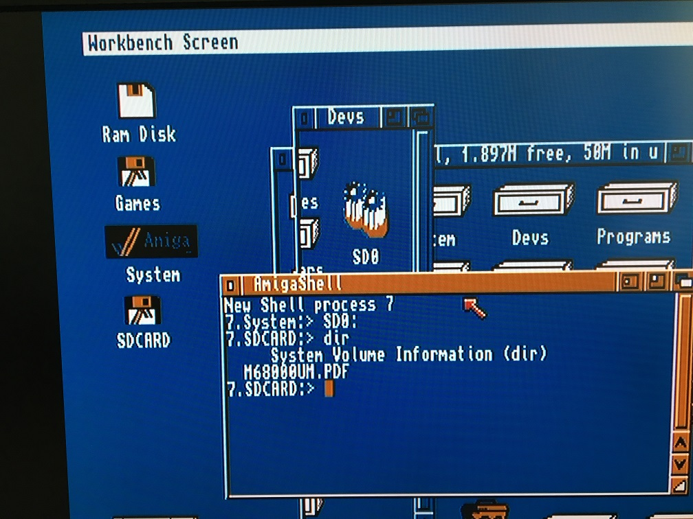
</a>

***

### Running sdbox on a stock A500 with wb 1.3 on KS 1.3 booting from floppy with drivers installed

Running sdbox on a stock A500 with wb 1.3 on KS 1.3 original mask rom `v34.5` and booting wb adf (via gotek) with sdbox-drivers included. I removed the `printer.device` and the `printers` directory in order to get free space to fit the drivers on the floppy image.

<a href="../images/sdbox_on_stock_A500_gotek_boot.jpg">
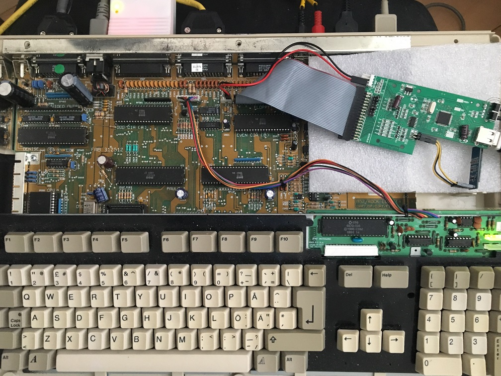
</a> 

Verifed working :
* `wb 1.3 (v34.20)` (`BlockSize = 512` needs to be removed and the entry `Reserved = 0` to be in the mountfile `SD0`)
* `wb 1.3.2 (v34.28)` (Requires `BlockSize = 512` entry in mountfile)
* `wb 1.3.3 (v34.34)` (Requires `BlockSize = 512` entry in mountfile)

Each entry must begin with the device name (in this case, `SD0:`) and must end with a number sign `#`.

    SD0:  FileSystem     = l:fat95
        Device         = spisd.device
        Unit           = 0
        Flags          = 0
        LowCyl         = 0
        HighCyl        = 0
        Surfaces       = 1
        BlocksPerTrack = 1
        BlockSize      = 512
        Reserved       = 0
        Buffers        = 20
        BufMemType     = 1
        BootPri        = 0
        StackSize      = 4096
        Priority       = 5
        GlobVec        = -1
        DosType        = 0x46415401
    #

<a href="../images/screenshots/wb_1.3_v34.20.jpg">
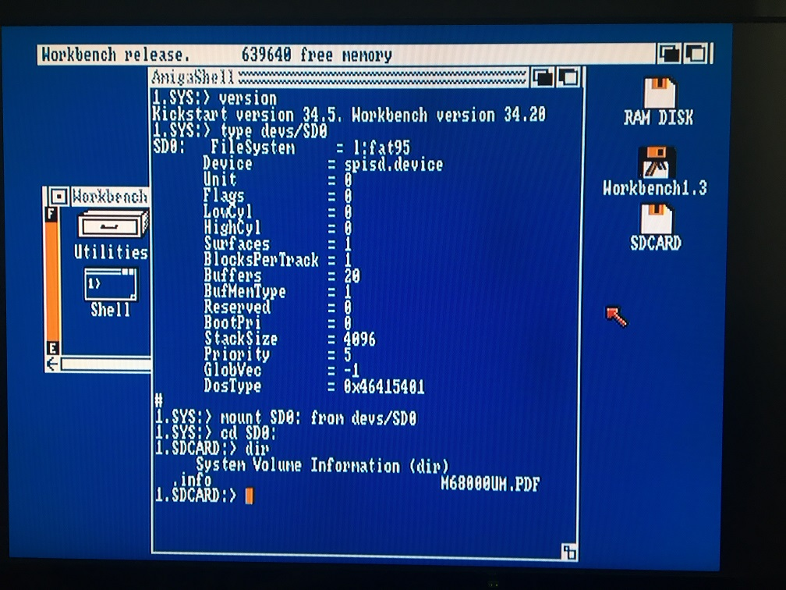
</a>
<a href="../images/screenshots/wb_1.3.2_v34.28.jpg">
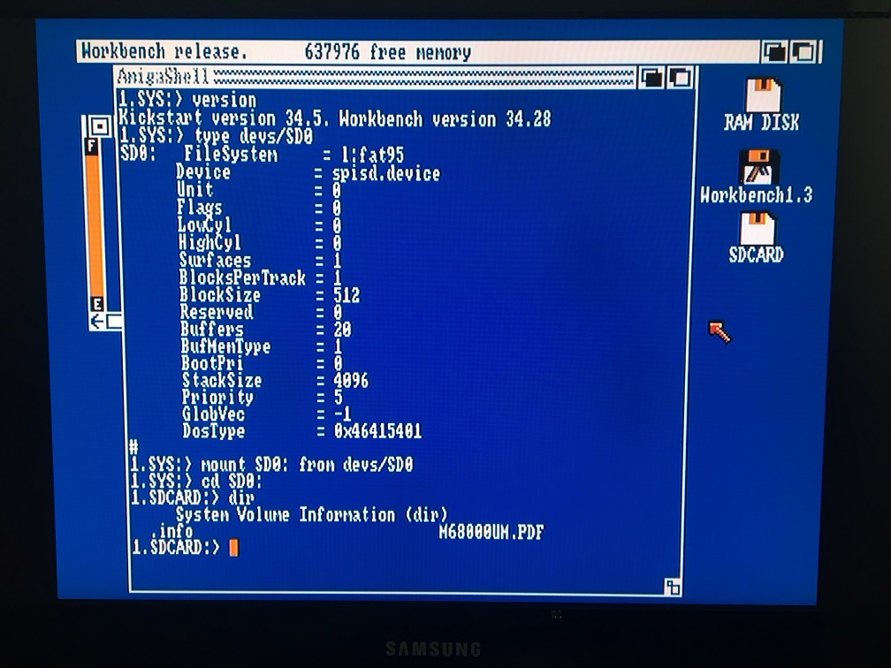
</a>
<a href="../images/screenshots/wb_1.3.3_v34.34.jpg">
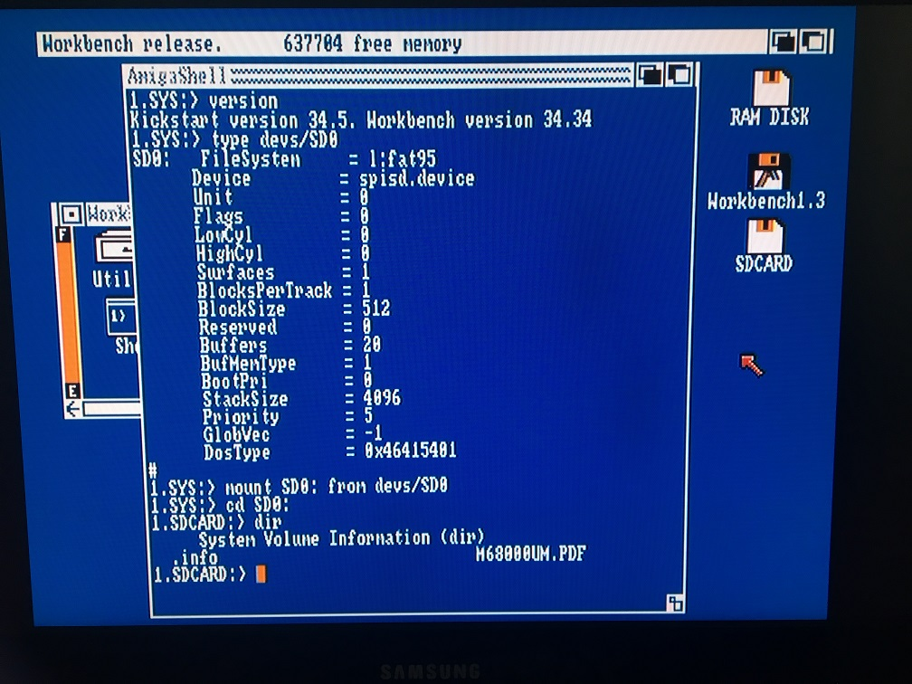
</a> 
 

Please note, in order to see files and folders appear as icons in wb 1.3 you need `*.info` files of correct type that matches the names of your folder or file since 1.3 doesn't seem to have a "show all folder and files" option.

***

### Running sdbox on a stock A500 with wb 3.1 on KS 3.1 booting from floppy with drivers installed

You can mount either via command line or double-click the SD0 file:

<a href="../images/screenshots/wb_3.1_v40.42_pic1.jpg">
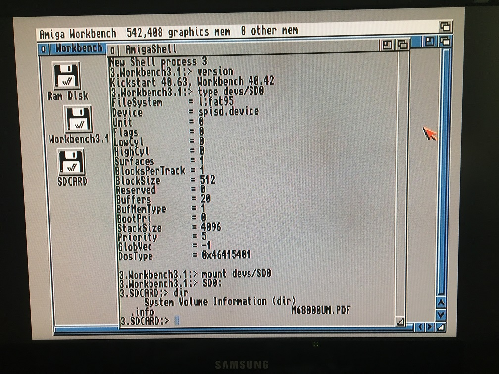
</a>
<a href="../images/screenshots/wb_3.1_v40.42_pic2.jpg">
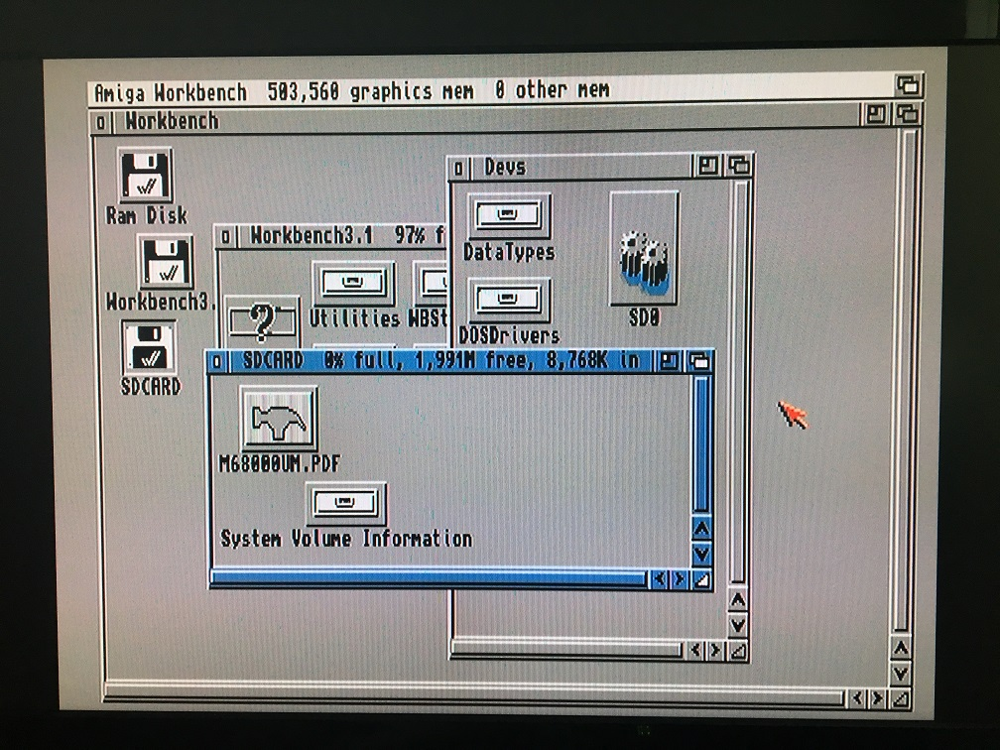
</a>

***

### Running sdbox on a A1200

<a href="../images/sdbox_installed_on_A1200_pic1.jpg">
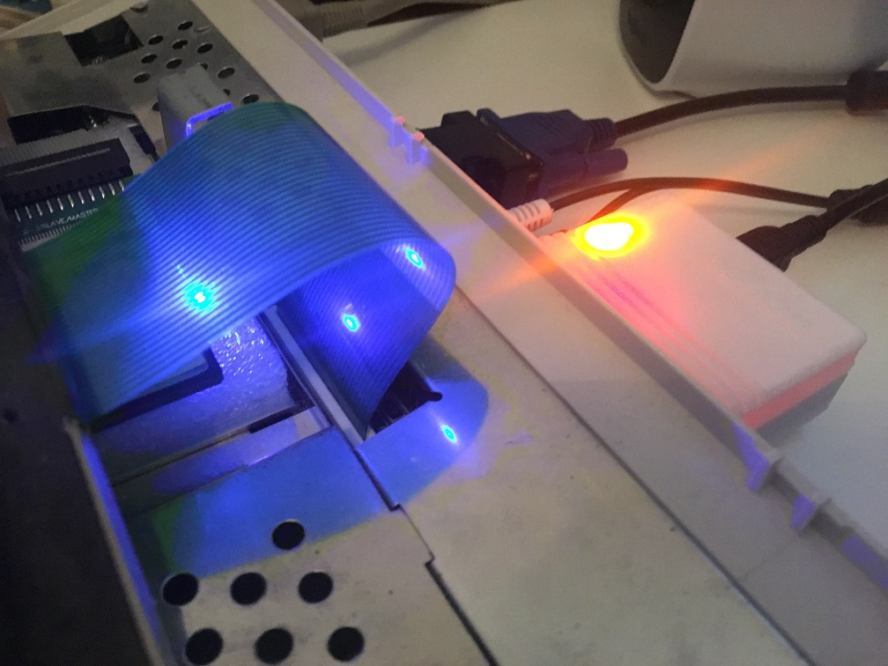
</a>
<a href="../images/sdbox_installed_on_A1200_pic2.jpg">
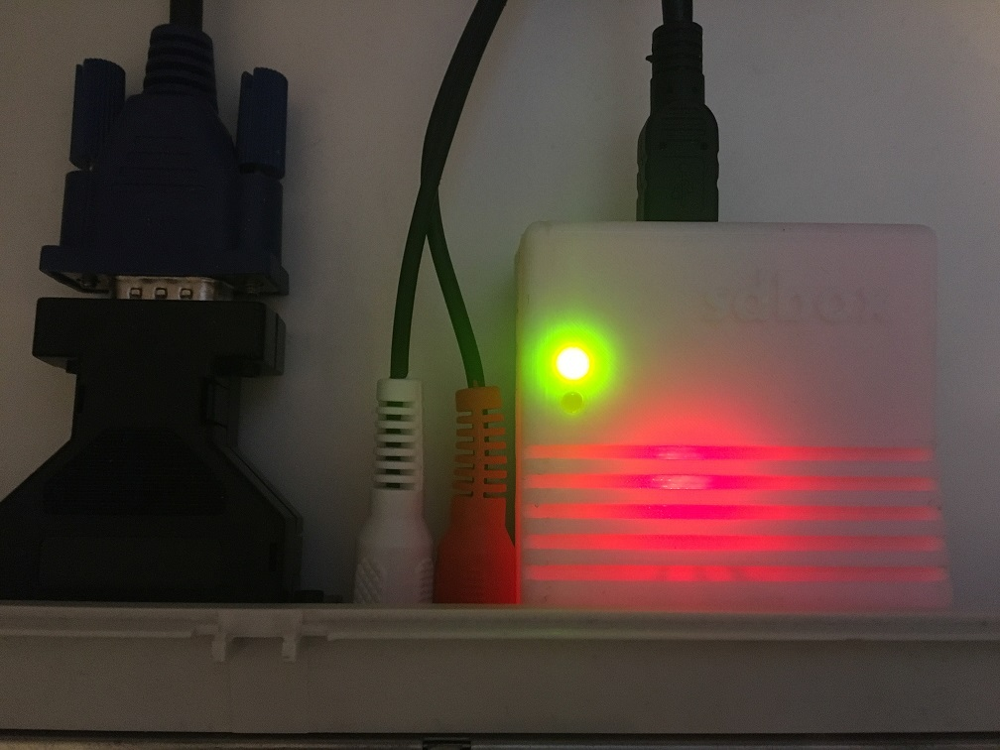
</a> 
<a href="../images/screenshots/copying_drag_n_drop_A1200_314_pic1.jpg">
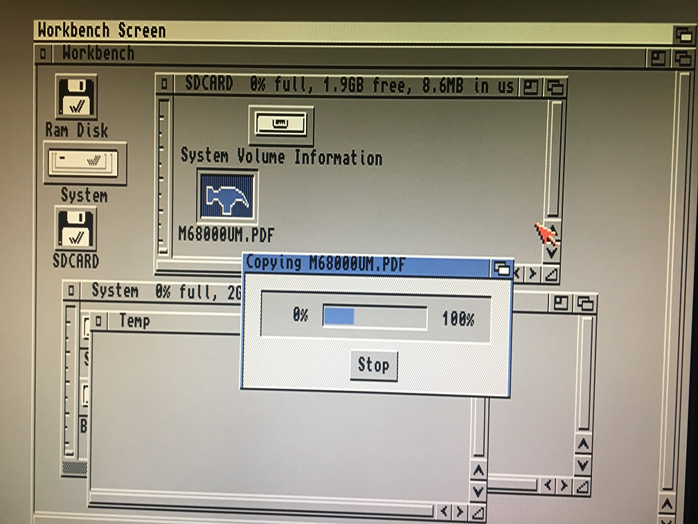
</a>
<a href="../images/screenshots/copying_drag_n_drop_A1200_314_pic2.jpg">
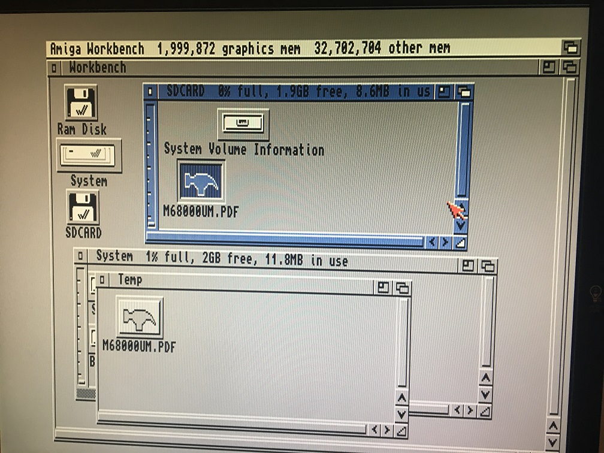
</a>

***

Copying driver file over via Kermit (`cki196.exe` for Amiga 3.1) and a null modem cable:

<a href="../images/screenshots/kermit_transfer_pic1.jpg">
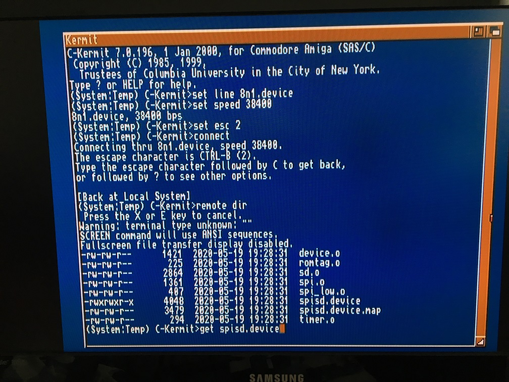
</a>

<a href="../images/screenshots/kermit_transfer_pic2.jpg">
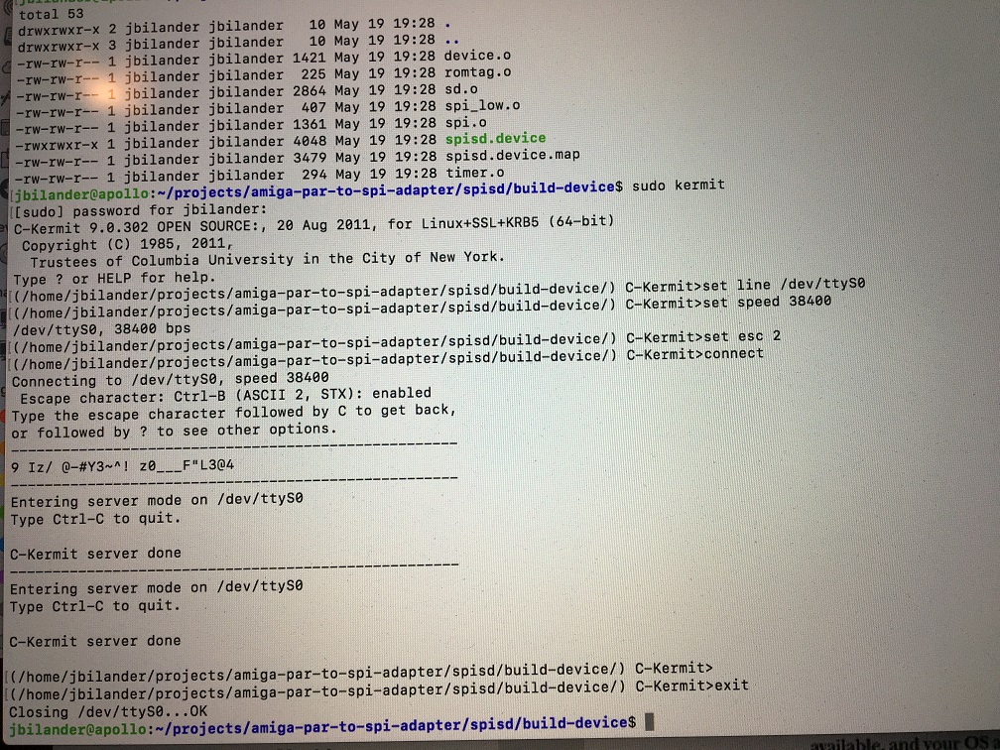
</a>

***

If you get the `bad number`error when trying to access `SDO:` after mounting the `SD0` file it may be an indication that your card isn't compatible with the sdbox for some reason. Try another card and see if it works better.

<a href="../images/screenshots/bad_number_error_mounting_sd0.jpg">
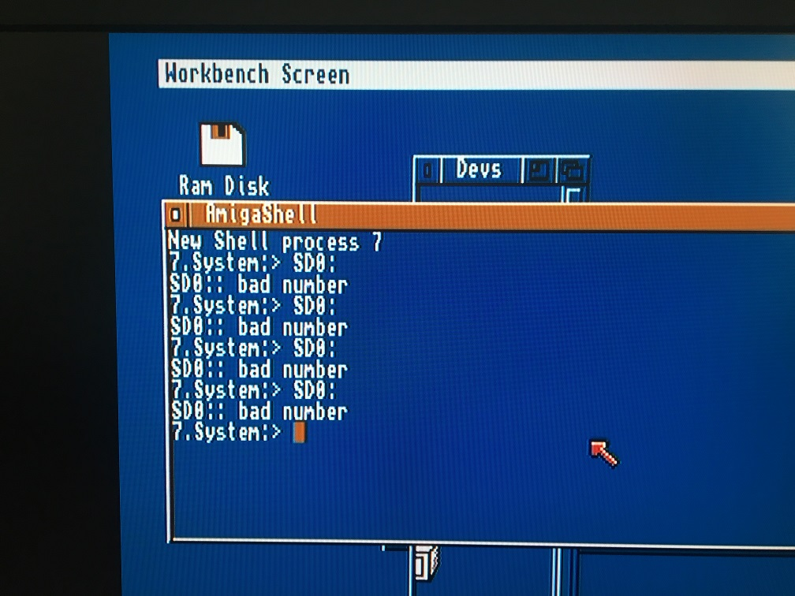
</a>

***
